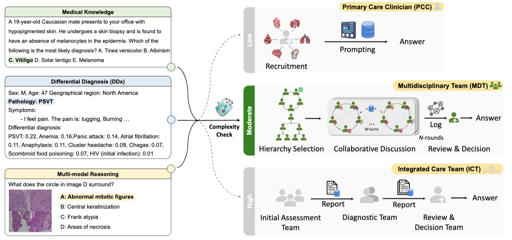

# Adaptive Collaboration Strategy for LLMs in Medical Decision Making (2024)

<!--<p align="center">
   
</p>-->



Foundation models are becoming invaluable tools in medicine. Despite their promise, the strategic deployment of Large Language Models (LLMs) for effective utility in complex medical tasks remains an open question. We introduce a novel framework, <ins><b>M</b></ins>edical <ins><b>D</b></ins>ecision-making <ins><b>Agents</b></ins> (**MDAgents**) which aims to address this gap by automatically assigning a collaboration structure for a team of LLMs. The assigned solo or group collaboration structure is tailored to the medical task at hand, a simple emulation of how real-world medical decision-making processes adapt to tasks of different complexities. We evaluate our framework and baseline methods with state-of-the-art LLMs across a suite of medical benchmarks containing real-world medical knowledge and challenging clinical diagnosis. MDAgents achieved the best performance in **seven out of ten** benchmarks on the tasks that require an understanding of medical knowledge and multi-modal reasoning, showing a significant improvement of up to **11.8\%** compared to previous multi-agent setting (p < 0.05). Ablation studies reveal that our MDAgents effectively determines medical complexity to optimize for \emph{efficiency} and \emph{accuracy} across diverse medical tasks. We also explore the dynamics of group consensus, offering insights into how collaborative agents could behave in complex clinical team dynamics.

<br>
<br>

## Quick Start

Create a new virtual environment, e.g. with conda

```bash
~$ conda create -n mdagents python>=3.9
```

Install the required packages:
```bash
~$ pip install -r requirements.txt
```

Activate the environment:
```bash
~$ conda activate mdagents
```

<br>

## Dataset

<p align="center">
  
</p>

<br>

1) MedQA: [https://github.com/jind11/MedQA?tab=readme-ov-file](https://github.com/jind11/MedQA?tab=readme-ov-file)
2) MedMCQA: [https://github.com/medmcqa/medmcqa](https://github.com/medmcqa/medmcqa)
3) PubMedQA: [https://github.com/pubmedqa/pubmedqa](https://github.com/pubmedqa/pubmedqa)
4) DDXPlus: [https://github.com/mila-iqia/ddxplus](https://github.com/mila-iqia/ddxplus)
5) PMC-VQA: [https://github.com/xiaoman-zhang/PMC-VQA](https://github.com/xiaoman-zhang/PMC-VQA)
6) Path-VQA: [https://github.com/UCSD-AI4H/PathVQA](https://github.com/UCSD-AI4H/PathVQA)
7) MedVidQA: [https://github.com/deepaknlp/MedVidQACL](https://github.com/deepaknlp/MedVidQACL)

<br>

## Comparison to Prior Methods

<p align="center">
  
</p>

<br>

## Inference

```bash
~$ python3 main.py --model {gpt-3.5, gpt-4, gpt-4v, gemini-pro, gemini-pro-vision} --dataset {medqa, medmcqa, pubmedqa, ddxplus, pmc-vqa, path-vqa, medvidqa}
```

<br>

## Main Results

<p align="center">
  
  
</p>

<br>
<br>


## TODO

- [ ] update main.py
- [ ] add baseline models
- [ ] add eval.py
- [ ] add more benchmarks (mmlu, mmmu, inspect, etc)
